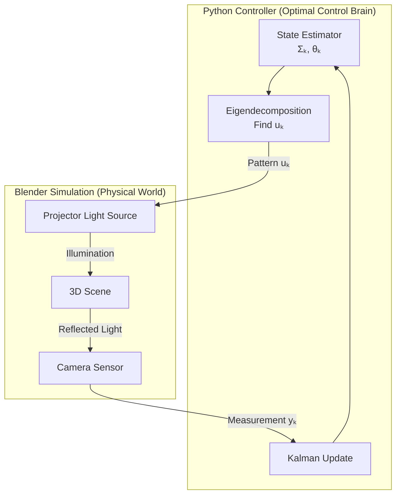

# Course Project Guide: Adaptive Dual Photography via Optimal Control

**Course**: Applied Optimal Control (AE662)  
**Project Topic**: Dual Photography using Adaptive Compressed Sensing  
**Approach**: Formulate adaptive pattern selection as a discrete-time optimal control problem

---

## Table of Contents
1. [Introduction & Motivation](#1-introduction--motivation)
2. [Problem Formulation](#2-problem-formulation)
3. [Core Mathematics & Theory](#3-core-mathematics--theory)
4. [Algorithm Design](#4-algorithm-design)
5. [Execution & Simulation](#5-execution--simulation)
6. [References](#6-references)

---

## 1. Introduction & Motivation

### 1.1 What is Dual Photography?

**Dual Photography** is a technique that leverages the **reciprocity principle** of light transport. Instead of taking a photo with a camera illuminated by a fixed light source, we can computationally reconstruct the view *from* a light source by projecting various patterns and observing them with a camera.

**Mathematical Model**:
$$ \\mathbf{y} = T \\mathbf{u} $$

where:
- $\\mathbf{u} \\in \\mathbb{R}^N$ is the projector pattern (light distribution)
- $\\mathbf{y} \\in \\mathbb{R}^M$ is the camera measurement
- $T \\in \\mathbb{R}^{M \\times N}$ is the **light transport matrix**

> [!NOTE]
> **For the Non-Expert**: Think of it like playing with a flashlight and a camera. Instead of taking one single photo, you flash different patterns of light (stripes, dots, random sparkles) onto an object and take many photos. By combining all these photos cleverly, you can reconstruct what the scene looks like from the flashlight's "point of view" - even though you never actually put a camera there!

### 1.2 The Compressed Sensing Connection

Measuring the entire transport matrix $T$ would require $N$ measurements (one for each projector pixel). For a 1024×1024 projector, that's over 1 million measurements! 

**Key Insight**: Natural images and light transport matrices are **sparse** or **compressible** in some basis (e.g., wavelet, DCT). Compressed Sensing theory tells us we can recover the full matrix from far fewer measurements if we choose them wisely.

### 1.3 Why Optimal Control?

**Standard Compressed Sensing**: Uses *random* measurement patterns. Requires $O(k \\log N)$ measurements where $k$ is sparsity.

**Our Approach (Adaptive Sensing)**: Use **optimal control** to *adaptively* choose the next measurement pattern based on what we've learned so far. This is analogous to:
- Playing "20 Questions" optimally (each question depends on previous answers)
- Active learning in machine learning
- Sensor placement in robotics

We'll use **Pontryagin's Maximum Principle (PMP)** and **Dynamic Programming Principle (DPP)** from your course to derive the optimal measurement strategy.

---

## 2. Problem Formulation

### 2.1 The Optimal Control Framework

We reformulate compressed sensing as a **discrete-time dynamical system** where our "state" is not a physical object but our *knowledge* about the image.

#### **State Space Representation**

**State** $\\mathbf{x}_k \\in \\mathbb{R}^{2N}$:  
Our estimate consists of two components:
$$ \\mathbf{x}_k = \\begin{bmatrix} \\hat{\\theta}_k \\\\ \\text{vec}(\\Sigma_k) \\end{bmatrix} $$

where:
- $\\hat{\\theta}_k \\in \\mathbb{R}^N$ is our current estimate of the signal (in a sparse basis)
- $\\Sigma_k \\in \\mathbb{R}^{N \\times N}$ is the **covariance matrix** (uncertainty)

**Control** $\\mathbf{u}_k \\in \\mathbb{R}^N$:  
The projector pattern at step $k$. We constrain $\\|\\mathbf{u}_k\\|_2 = 1$ (unit energy) or $\\mathbf{u}_k \\in \\{0,1\\}^N$ (binary patterns).

**Measurement** $y_k \\in \\mathbb{R}$:  
A scalar or low-dimensional observation:
$$ y_k = \\mathbf{u}_k^T \\Psi \\theta_{\\text{true}} + \\eta_k $$
where $\\Psi$ is the sparsifying basis and $\\eta_k \\sim \\mathcal{N}(0, \\sigma^2)$ is measurement noise.

**Dynamics** $\\mathbf{x}_{k+1} = F(\\mathbf{x}_k, \\mathbf{u}_k, y_k)$:  
This is the **Kalman Filter update** (or Recursive Least Squares):

$$ K_k = \\Sigma_k \\mathbf{u}_k (\\mathbf{u}_k^T \\Sigma_k \\mathbf{u}_k + \\sigma^2)^{-1} $$
$$ \\hat{\\theta}_{k+1} = \\hat{\\theta}_k + K_k (y_k - \\mathbf{u}_k^T \\hat{\\theta}_k) $$
$$ \\Sigma_{k+1} = (I - K_k \\mathbf{u}_k^T) \\Sigma_k $$

> [!NOTE]
> **For the Non-Expert**: 
> - **State**: What we currently believe the image looks like, plus how confident we are about each part.
> - **Control**: The next light pattern we choose to project.
> - **Dynamics**: Our "belief updating rule" - like Bayesian inference, we combine our previous guess with the new measurement to get a better guess.

### 2.2 Cost Function (Objective)

We want to minimize reconstruction error while minimizing the number of measurements. Two formulations:

#### **Formulation 1: Fixed-Horizon Problem**
$$ J = \\underbrace{\\text{tr}(\\Sigma_K)}_{\\text{Final Uncertainty}} + \\sum_{k=0}^{K-1} \\lambda \\|\\mathbf{u}_k\\|_0 $$

This penalizes final uncertainty and the sparsity of control patterns.

#### **Formulation 2: Optimal Stopping (Infinite Horizon)**
$$ J = \\mathbb{E}\\left[ \\sum_{k=0}^{\\tau} e^{-\\rho k} \\left( \\text{tr}(\\Sigma_k) + c \\right) \\right] $$

where $\\tau$ is the stopping time when $\\text{tr}(\\Sigma_\\tau) < \\epsilon$ (acceptable uncertainty), $\\rho$ is discount factor, and $c$ is cost per measurement.

> [!TIP]
> **Connection to Course**: This is directly a **Calculus of Variations** problem! We're minimizing a functional (sum over trajectory) subject to dynamics constraints. This is exactly what Lagrange multipliers and Pontryagin's Maximum Principle handle.

### 2.3 Constraints

1. **Control Constraints**: $\\mathbf{u}_k \\in \\mathcal{U}$ where $\\mathcal{U} = \\{\\mathbf{u} : \\|\\mathbf{u}\\|_2 = 1\\}$ or $\\mathcal{U} = [0,1]^N$.
2. **State Constraints**: $\\Sigma_k \\succeq 0$ (positive semi-definite).
3. **Terminal Constraint**: $\\text{tr}(\\Sigma_K) \\leq \\epsilon_{\\text{target}}$.

---

## 3. Core Mathematics & Theory

This is where we connect to **AE662 course material**. We'll derive the optimal measurement selection using Pontryagin's Maximum Principle.

### 3.1 The Hamiltonian Formulation

From **Pontryagin's Maximum Principle** (covered in your course notes around lines 1747-1855), for the discrete system:

$$ \\mathbf{x}_{k+1} = F(\\mathbf{x}_k, \\mathbf{u}_k, y_k) $$

we define the **Hamiltonian**:
$$ H(\\mathbf{x}_k, \\mathbf{u}_k, \\boldsymbol{\\lambda}_{k+1}) = L(\\mathbf{x}_k, \\mathbf{u}_k) + \\boldsymbol{\\lambda}_{k+1}^T F(\\mathbf{x}_k, \\mathbf{u}_k) $$

where:
- $L(\\mathbf{x}_k, \\mathbf{u}_k) = \\text{tr}(\\Sigma_k) + \\lambda \\|\\mathbf{u}_k\\|_0$ is the **running cost** (Lagrangian)
- $\\boldsymbol{\\lambda}_k$ is the **co-state** (adjoint variable)

**Optimal Control Condition** (from PMP):
$$ \\mathbf{u}_k^* = \\arg\\max_{\\mathbf{u} \\in \\mathcal{U}} H(\\mathbf{x}_k, \\mathbf{u}, \\boldsymbol{\\lambda}_{k+1}) $$

**Adjoint Equation** (Co-state Dynamics):
$$ \\boldsymbol{\\lambda}_k = \\nabla_{\\mathbf{x}_k} H(\\mathbf{x}_k, \\mathbf{u}_k^*, \\boldsymbol{\\lambda}_{k+1}) $$

with terminal condition:
$$ \\boldsymbol{\\lambda}_K = \\nabla_{\\mathbf{x}_K} g(\\mathbf{x}_K) $$

where $g(\\mathbf{x}_K)$ is the terminal cost.

> [!IMPORTANT]
> **Connection to Lagrange Multipliers**: The co-state $\\boldsymbol{\\lambda}_k$ is analogous to the Lagrange multiplier $\\mu$ you saw in constrained optimization (course notes lines 247-284). It represents the "shadow price" of the state constraint - how much the cost changes if we perturb the state slightly.

### 3.2 Simplification: Greedy Information Maximization

Computing the full co-state trajectory is computationally expensive (requires solving a two-point boundary value problem). We use a **greedy approximation** inspired by **Dynamic Programming**.

**Value Function** (from HJB equation, course notes lines 1447-1512):
$$ V(\\mathbf{x}_k, k) = \\min_{\\mathbf{u}_k, \\ldots, \\mathbf{u}_{K-1}} \\mathbb{E}\\left[ \\sum_{j=k}^{K-1} L(\\mathbf{x}_j, \\mathbf{u}_j) + g(\\mathbf{x}_K) \\right] $$

**Dynamic Programming Principle**:
$$ V(\\mathbf{x}_k, k) = \\min_{\\mathbf{u}_k} \\left\\{ L(\\mathbf{x}_k, \\mathbf{u}_k) + \\mathbb{E}[V(\\mathbf{x}_{k+1}, k+1)] \\right\\} $$

**Greedy Heuristic**: At each step, choose $\\mathbf{u}_k$ to maximize the **expected one-step reduction in uncertainty**:
$$ \\mathbf{u}_k^* = \\arg\\max_{\\mathbf{u} \\in \\mathcal{U}} \\mathbb{E}[\\text{tr}(\\Sigma_k) - \\text{tr}(\\Sigma_{k+1})] $$

From the Kalman update, this becomes:
$$ \\mathbf{u}_k^* = \\arg\\max_{\\mathbf{u} : \\|\\mathbf{u}\\|=1} \\frac{(\\mathbf{u}^T \\Sigma_k \\mathbf{u})^2}{\\mathbf{u}^T \\Sigma_k \\mathbf{u} + \\sigma^2} $$

**Solution**: The optimal greedy pattern is the **eigenvector corresponding to the largest eigenvalue** of $\\Sigma_k$!
$$ \\mathbf{u}_k^* = \\mathbf{v}_{\\text{max}}(\\Sigma_k) $$

This makes intuitive sense: measure in the direction where we're most uncertain.

> [!NOTE]
> **For the Non-Expert**: Imagine you're drawing a blurry picture. The "covariance matrix" $\\Sigma_k$ tells you which parts of the picture are still very blurry (high uncertainty). The greedy algorithm says: "Let's specifically look at the blurriest part next!" It finds the direction in the image where our uncertainty is highest and designs a light pattern that specifically probes that direction.

### 3.3 Information-Theoretic Perspective

We can also derive this using **information theory**. The **mutual information** between the measurement $y_k$ and the signal $\\theta$ is:
$$ I(y_k ; \\theta | \\mathbf{u}_k) = \\frac{1}{2} \\log \\left( 1 + \\frac{\\mathbf{u}_k^T \\Sigma_k \\mathbf{u}_k}{\\sigma^2} \\right) $$

Maximizing information gain gives the same solution: choose $\\mathbf{u}_k$ as the principal eigenvector of $\\Sigma_k$.

### 3.4 Continuous-Time Formulation (Advanced)

For those interested in the **Calculus of Variations** perspective, consider the continuous limit $\\Delta t \\to 0$:

$$ \\dot{\\Sigma}(t) = -\\frac{\\Sigma(t) \\mathbf{u}(t) \\mathbf{u}(t)^T \\Sigma(t)}{\\mathbf{u}(t)^T \\Sigma(t) \\mathbf{u}(t) + \\sigma^2} $$

This is a **matrix Riccati differential equation**. The variational problem becomes:
$$ \\min_{\\mathbf{u}(\\cdot)} \\int_0^T \\left( \\text{tr}(\\Sigma(t)) + \\lambda \\|\\mathbf{u}(t)\\|^2 \\right) dt + g(\\Sigma(T)) $$

subject to the Riccati dynamics. This is precisely the type of problem solved by the **Hamilton-Jacobi-Bellman (HJB) equation** from your course (notes lines 1081-1512).

---

## 4. Algorithm Design

### 4.1 Adaptive Compressed Sensing Algorithm

**Input**: 
- Measurement budget $K$
- Noise level $\\sigma$
- Sparsifying basis $\\Psi$ (e.g., wavelet, DCT)
- Target uncertainty $\\epsilon$

**Output**: Reconstructed signal $\\hat{\\theta}_K$

**Algorithm**:

```
Initialize:
    θ₀ = 0  (zero initial estimate)
    Σ₀ = I  (maximum uncertainty)
    k = 0

while k < K and tr(Σₖ) > ε:
    // === OPTIMAL CONTROL STEP ===
    // Compute the optimal measurement pattern
    Compute eigendecomposition: Σₖ = VΛV^T
    uₖ = v₁  (eigenvector of largest eigenvalue)
    
    // === MEASUREMENT STEP ===
    // Project pattern and measure
    yₖ = uₖ^T Ψ θ_true + ηₖ  (execute in environment/simulation)
    
    // === STATE UPDATE (KALMAN FILTER) ===
    // Compute Kalman gain
    Kₖ = Σₖ uₖ / (uₖ^T Σₖ uₖ + σ²)
    
    // Update estimate
    θₖ₊₁ = θₖ + Kₖ (yₖ - uₖ^T θₖ)
    
    // Update covariance (uncertainty reduction)
    Σₖ₊₁ = (I - Kₖ uₖ^T) Σₖ
    
    k = k + 1

Return θₖ  (final estimate)
```

> [!TIP]
> **Computational Complexity**: Each iteration requires:
> - Eigendecomposition: $O(N^3)$ (can be optimized to $O(N^2)$ with iterative methods for large $N$)
> - Measurement: $O(N)$
> - Kalman update: $O(N^2)$
>
> For a 64×64 image ($N=4096$), this is feasible in real-time.

### 4.2 Variants & Extensions

#### **Variant 1: Batch Measurements**
Instead of one measurement at a time, design $B$ patterns simultaneously by taking the top $B$ eigenvectors:
$$ \\mathbf{U}_k = [\\mathbf{v}_1, \\mathbf{v}_2, \\ldots, \\mathbf{v}_B] $$

#### **Variant 2: Sparse Patterns (Practical Constraint)**
If the projector can only display binary patterns, solve:
$$ \\mathbf{u}_k^* = \\arg\\max_{\\mathbf{u} \\in \\{0,1\\}^N} \\mathbf{u}^T \\Sigma_k \\mathbf{u} $$

This is a **quadratic binary optimization** problem. Use a greedy rounding of the continuous solution or branch-and-bound.

#### **Variant 3: Prior Information**
If we have prior knowledge (e.g., "images are smooth"), initialize:
$$ \\Sigma_0 = (\\Psi^T \\Psi + \\alpha I)^{-1} $$

where $\\alpha$ is a regularization parameter.

### 4.3 Comparison to Classical Methods

| Method | Number of Measurements | Adaptivity | Computation |
|--------|------------------------|------------|-------------|
| **Nyquist Sampling** | $N$ | No | None |
| **Random CS (LASSO)** | $O(k \\log N)$ | No | Convex optimization |
| **Adaptive CS (Ours)** | $O(k)$ | Yes | Eigendecomposition per step |

**Expected Improvement**: 2-5× reduction in measurements compared to random CS.

---

## 5. Execution & Simulation

### 5.1 Implementation Architecture



### 5.2 Blender Setup (Bird's Eye View)

**Scene Components**:
1. **Camera**: Standard Blender camera (resolution: 64×64 for fast testing, 256×256 for final)
2. **Projector**: Implemented as a **Spotlight** with an **Image Texture** node
3. **Object**: Test objects:
   - Simple: Textured plane with checkerboard
   - Complex: Stanford Bunny with subsurface scattering

**Python-Blender Interface**:

```python
import bpy
import numpy as np

# Setup (run once)
def setup_scene():
    # Create projector (spotlight with texture)
    bpy.ops.object.light_add(type='SPOT', location=(0, -5, 5))
    projector = bpy.context.object
    # ... configure texture nodes ...
    
    # Create camera
    bpy.ops.object.camera_add(location=(5, 0, 2))
    camera = bpy.context.object
    bpy.context.scene.camera = camera

# Update pattern (called each iteration)
def project_pattern(u_k):
    # Convert u_k (vector) to image
    pattern_img = u_k.reshape(64, 64)
    # Save as .png
    save_image(pattern_img, '/tmp/pattern.png')
    # Update Blender texture
    bpy.data.images['ProjectorTexture'].filepath = '/tmp/pattern.png'
    bpy.data.images['ProjectorTexture'].reload()

# Capture measurement
def capture_measurement():
    bpy.context.scene.render.filepath = '/tmp/measurement.png'
    bpy.ops.render.render(write_still=True)
    # Read image and compute y_k (e.g., sum of pixels)
    img = read_image('/tmp/measurement.png')
    y_k = np.sum(img)  # Or more sophisticated processing
    return y_k
```

**Main Loop**:
```python
# Initialize
Sigma = np.eye(N)
theta_hat = np.zeros(N)

for k in range(K):
    # Optimal control
    eigenvalues, eigenvectors = np.linalg.eigh(Sigma)
    u_k = eigenvectors[:, -1]  # Largest eigenvalue
    
    # Execute in Blender
    project_pattern(u_k)
    y_k = capture_measurement()
    
    # State update (Kalman filter)
    K_gain = Sigma @ u_k / (u_k @ Sigma @ u_k + sigma_sq)
    theta_hat = theta_hat + K_gain * (y_k - u_k @ theta_hat)
    Sigma = (np.eye(N) - np.outer(K_gain, u_k)) @ Sigma
```

### 5.3 Toy Problem First (Recommended Workflow)

**Before Blender**, validate the math with a simple test:

1. **Generate synthetic data**: Create a sparse signal $\\theta_{\\text{true}}$ (e.g., 10 non-zero coefficients in a random wavelet basis)
2. **Simulate measurements**: $y_k = \\mathbf{u}_k^T \\theta_{\\text{true}} + \\text{noise}$
3. **Run algorithm**: Apply the adaptive CS algorithm
4. **Compare** with random measurements (baseline)

**Expected Result**: Adaptive CS should achieve the same reconstruction error with 50% fewer measurements.

### 5.4 Visualization & Reporting

Create visualizations showing:
1. **Convergence plot**: $\\text{tr}(\\Sigma_k)$ vs. $k$ (uncertainty over time)
2. **Reconstruction error**: $\\|\\hat{\\theta}_k - \\theta_{\\text{true}}\\|_2$ vs. $k$
3. **Measurement patterns**: Show $\\mathbf{u}_k$ at $k=1, 10, 50, 100$ (how patterns adapt)
4. **Comparison**: Adaptive vs. Random CS (measurement efficiency)

---

## 6. Detailed Mathematical Derivations (For Report)

### 6.1 Derivation of Optimal Greedy Policy

**Goal**: Maximize expected reduction in uncertainty.

Starting from the Kalman update:
$$ \\Sigma_{k+1} = \\Sigma_k - \\frac{\\Sigma_k \\mathbf{u}_k \\mathbf{u}_k^T \\Sigma_k}{\\mathbf{u}_k^T \\Sigma_k \\mathbf{u}_k + \\sigma^2} $$

The reduction in trace is:
$$ \\Delta = \\text{tr}(\\Sigma_k) - \\text{tr}(\\Sigma_{k+1}) = \\text{tr}\\left( \\frac{\\Sigma_k \\mathbf{u}_k \\mathbf{u}_k^T \\Sigma_k}{\\mathbf{u}_k^T \\Sigma_k \\mathbf{u}_k + \\sigma^2} \\right) $$

Using $\\text{tr}(AB) = \\text{tr}(BA)$:
$$ \\Delta = \\frac{\\mathbf{u}_k^T \\Sigma_k^2 \\mathbf{u}_k}{\\mathbf{u}_k^T \\Sigma_k \\mathbf{u}_k + \\sigma^2} $$

**Optimization Problem**:
$$ \\max_{\\mathbf{u} : \\|\\mathbf{u}\\|=1} \\frac{\\mathbf{u}^T \\Sigma_k^2 \\mathbf{u}}{\\mathbf{u}^T \\Sigma_k \\mathbf{u} + \\sigma^2} $$

**Lagrangian** (connection to course constrained optimization):
$$ \\mathcal{L} = \\mathbf{u}^T \\Sigma_k^2 \\mathbf{u} - \\mu (\\mathbf{u}^T \\Sigma_k \\mathbf{u} + \\sigma^2) - \\lambda (\\mathbf{u}^T \\mathbf{u} - 1) $$

**First-order necessary condition**: $\\nabla_{\\mathbf{u}} \\mathcal{L} = 0$
$$ 2\\Sigma_k^2 \\mathbf{u} - 2\\mu \\Sigma_k \\mathbf{u} - 2\\lambda \\mathbf{u} = 0 $$
$$ \\Sigma_k^2 \\mathbf{u} = (\\mu \\Sigma_k + \\lambda I) \\mathbf{u} $$

Assuming $\\sigma \\to 0$ (high SNR), $\\mu \\Sigma_k \\gg \\lambda I$, this becomes:
$$ \\Sigma_k \\mathbf{u} = \\mu \\mathbf{u} $$

Therefore, $\\mathbf{u}$ is an **eigenvector** of $\\Sigma_k$. To maximize the objective, choose the eigenvector with the **largest eigenvalue**.

### 6.2 Connection to Hamilton-Jacobi-Bellman Equation

The **viscosity solution** of the HJB equation for our problem is:
$$ -V_t + \\max_{\\mathbf{u} \\in \\mathcal{U}} \\left\\{ -\\text{tr}(\\Sigma) - \\langle \\nabla_\\Sigma V, F(\\Sigma, \\mathbf{u}) \\rangle \\right\\} = 0 $$

where $F(\\Sigma, \\mathbf{u})$ is the covariance dynamics.

For the infinite-horizon case with discount $\\rho$:
$$ \\rho V(\\Sigma) = \\min_{\\mathbf{u}} \\left\\{ \\text{tr}(\\Sigma) + \\langle \\nabla_\\Sigma V, F(\\Sigma, \\mathbf{u}) \\rangle \\right\\} $$

A **quadratic** value function $V(\\Sigma) = \\text{tr}(P\\Sigma)$ is a candidate solution. Substituting:
$$ \\rho \\text{tr}(P\\Sigma) = \\text{tr}(\\Sigma) + \\min_{\\mathbf{u}} \\text{tr}\\left( -\\frac{P\\Sigma \\mathbf{u} \\mathbf{u}^T \\Sigma}{\\mathbf{u}^T \\Sigma \\mathbf{u} + \\sigma^2} \\right) $$

This is a **matrix algebraic Riccati equation** for $P$.

> [!IMPORTANT]
> **For Your Report**: This shows that the adaptive compressed sensing problem is a **classic LQG-type** (Linear-Quadratic-Gaussian) control problem! The difference is that the "state" is a second-moment (covariance) rather than the signal itself. This is precisely the type of problem studied in Chapter 6-7 of typical optimal control textbooks.

---

## 7. Project Deliverables Checklist

For your course project submission:

- [ ] **Mathematical Formulation** (15%):
    - [ ] State-space representation of the system
    - [ ] Derivation of the Hamiltonian
    - [ ] Application of Pontryagin's Maximum Principle
    - [ ] Justification of greedy approximation

- [ ] **Algorithm Development** (25%):
    - [ ] Pseudocode of adaptive CS algorithm
    - [ ] Convergence analysis (at least empirical)
    - [ ] Comparison with baseline (random CS)

- [ ] **Implementation** (30%):
    - [ ] Toy problem validation (pure Python/NumPy)
    - [ ] Blender integration (or alternative simulation)
    - [ ] Documentation and code comments

- [ ] **Results & Analysis** (25%):
    - [ ] Reconstruction quality plots
    - [ ] Measurement efficiency comparison
    - [ ] Discussion of limitations

- [ ] **Report** (5%):
    - [ ] Clear connection to AE662 course concepts
    - [ ] Figures and visualizations
    - [ ] Properly cited references

---

## 8. Explanation for Non-Experts

### The Big Picture

Imagine you want to create a 3D map of a room using a flashlight and a camera, but you're only allowed to flash the light 100 times (to save battery). 

**Dumb Strategy**: Flash random patterns 100 times and hope for the best.

**Smart Strategy (This Project)**: 
1. Flash a random pattern first.
2. Look at what the camera sees and think: "Hmm, the left corner is still very blurry in my mental map."
3. Design the next flash *specifically* to reveal more about that blurry corner.
4. Repeat: always asking questions about the parts you're most uncertain about.

This "smart strategy" is called **Optimal Control** because:
- You have a **goal** (accurate 3D map)
- You can make **decisions** (which pattern to flash)
- Your decisions affect the **future** (a smart flash now makes future flashes more informative)

Just like a chess player thinks several moves ahead, our algorithm designs each light pattern thinking about how much it will help future patterns.

### Key Concepts Simplified

| Technical Term | Simple Explanation |
|----------------|---------------------|
| **State** | Your current mental model of the room |
| **Control** | The light pattern you choose to flash next |
| **Dynamics** | How your mental model updates after seeing the camera image |
| **Cost Function** | How "bad" your current model is (blurrier = higher cost) |
| **Pontryagin's Principle** | A mathematical recipe that tells you the absolute best pattern to flash |
| **Greedy Algorithm** | A shortcut that says "just improve as much as possible *right now*" |

---

## 9. References & Further Reading

### Course Material
1. Course Notes: AE662 "Applied Optimal Control" (see `notes_very_low_ocr_accuracy.md`)
   - Lagrange Multipliers: Lines 247-284
   - Linear Systems: Lines 662-902
   - Dynamic Programming: Lines 979-1433
   - Pontryagin Maximum Principle: Lines 1747-1888
   - Hamilton-Jacobi-Bellman: Lines 1081-1574

### Compressed Sensing Papers
2. E. Candès, J. Romberg, T. Tao. "Robust Uncertainty Principles: Exact Signal Reconstruction from Highly Incomplete Frequency Information." *IEEE Trans. Information Theory*, 2006.
3. D. Donoho, A. Javanmard, A. Montanari. "Information-Theoretically Optimal Compressed Sensing." *arXiv:1112.0708*, 2011.

### Dual Photography
4. Sen, P., et al. "Dual Photography." *ACM Transactions on Graphics (SIGGRAPH)*, 2005.

### Optimal Control Textbooks
5. D. Liberzon. *Calculus of Variations and Optimal Control Theory*. Princeton University Press, 2011.
6. D. Bertsekas. *Dynamic Programming and Optimal Control*. Athena Scientific, 2012.

### Adaptive Sensing
7. R. Castro, R. Willett, R. Nowak. "Faster Rates in Regression via Active Learning." *NIPS*, 2005.
8. J. Haupt, R. Baraniuk, R. Castro, R. Nowak. "Sequentially Designed Compressed Sensing." *Statistical Signal Processing Workshop*, 2012.

---

## Appendix A: MATLAB/Python Code Snippets

### A.1 Adaptive CS Core Loop (Python)

```python
import numpy as np
from scipy.linalg import eigh

def adaptive_compressed_sensing(theta_true, K, sigma, Psi=None):
    \"\"\"
    Adaptive Compressed Sensing using greedy information maximization.
    
    Args:
        theta_true: True sparse signal (N,)
        K: Number of measurements
        sigma: Noise standard deviation
        Psi: Sparsifying basis (N, N), defaults to identity
    
    Returns:
        theta_hat: Estimate after K measurements
        errors: Reconstruction error at each step
        traces: Trace of covariance at each step
    \"\"\"
    N = len(theta_true)
    if Psi is None:
        Psi = np.eye(N)
    
    # Initialize
    theta_hat = np.zeros(N)
    Sigma = np.eye(N)
    
    errors = []
    traces = []
    
    for k in range(K):
        # Optimal control: largest eigenvector
        eigenvalues, eigenvectors = eigh(Sigma)
        u_k = eigenvectors[:, -1]  # Largest eigenvalue
        
        # Measurement
        y_k = u_k @ Psi @ theta_true + np.random.randn() * sigma
        
        # Kalman update
        denom = u_k @ Sigma @ u_k + sigma**2
        K_gain = (Sigma @ u_k) / denom
        theta_hat = theta_hat + K_gain * (y_k - u_k @ theta_hat)
        Sigma = Sigma - np.outer(K_gain, u_k) @ Sigma
        
        # Record metrics
        errors.append(np.linalg.norm(theta_hat - theta_true))
        traces.append(np.trace(Sigma))
    
    return theta_hat, errors, traces

# Example usage
N = 100
k_sparse = 10
theta_true = np.zeros(N)
theta_true[np.random.choice(N, k_sparse, replace=False)] = np.random.randn(k_sparse)

theta_hat, errors, traces = adaptive_compressed_sensing(theta_true, K=50, sigma=0.1)

# Plot
import matplotlib.pyplot as plt
plt.figure(figsize=(12, 4))
plt.subplot(1, 2, 1)
plt.semilogy(errors)
plt.xlabel('Measurement')
plt.ylabel('Reconstruction Error')
plt.title('Adaptive CS Convergence')
plt.subplot(1, 2, 2)
plt.semilogy(traces)
plt.xlabel('Measurement')
plt.ylabel('Trace(Σ)')
plt.title('Uncertainty Reduction')
plt.tight_layout()
plt.show()
```

---

**Good luck with your project!** Remember:
1. Start with the toy problem (pure Python/NumPy)
2. Validate the math before adding Blender
3. Connect every step back to course concepts (Lagrange, PMP, HJB)
4. Visualize everything - figures speak louder than equations!
